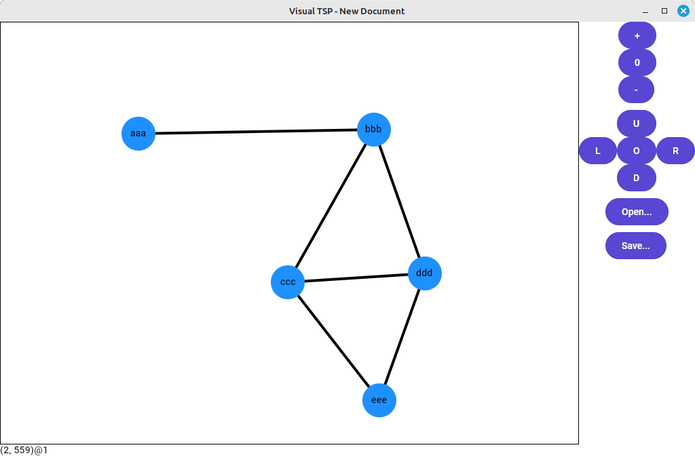
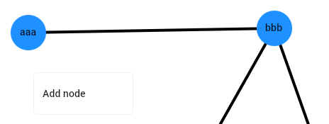
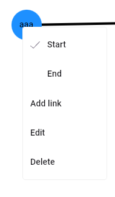
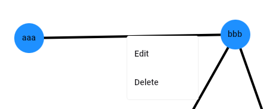
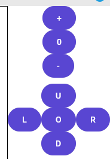

# VisualTSP - Visual Travelling Salesman Problem
Create, solve and see
[Travelling Salesman Problems](https://en.wikipedia.org/wiki/Travelling_salesman_problem)
visually!



## Prerequisites
### Required
* Dotnet 10.0 or higher
* git

## Getting started

```bash
# clone repository
git clone https://github.com/TrevorDArcyEvans/VisualTSP.git

# build code
cd VisualTSP/src
dotnet restore
dotnet build

# run
dotnet run --net10.0-desktop
```
# Usage

<details>

Most functionality can be accessed via a context sensitive menu aka right mouse button menu.

* add node
  * RMB on a blank space



* node operations
  * edit name
  * delete (will also delete attached links)
  * mark as start/end



* link operations
  * edit cost
  * delete



* view manipulations
  * zoom in/out/reset
  * pan left/right/up/down/reset
  


* file operations
  * open
  * save


</details>

## Discussion

### XAML serialisation

<details>

[How to save Canvas to JSON or XML in UWP?](https://learn.microsoft.com/en-us/answers/questions/1374191/how-to-save-canvas-to-json-or-xml-in-uwp)

Since there is no `XamlWriter ` in UWP, and, hence, Uno, we have to go through `JsonNode`, `JsonLink` and `JsonNetwork`
for our serialisation/deserialisation.  These classes shadow their corresponding `Visual*` classes and save enough
information to allow recreation of the `Visual*` objects.

</details>

## Further work
* asymmetric link costs

## Further information
* [Wikipedia](https://en.wikipedia.org/wiki/Travelling_salesman_problem)
* [AI_TSP](https://github.com/crylent/AI_TSP.git)
* [TravellingSalesmanProblem](https://github.com/TollyH/TravellingSalesmanProblem.git)
* [TSP-GA](https://github.com/bezzad/TSP-GA.git)
* [TSP-Simulated-Annealing](https://github.com/Inspiaaa/TSP-Simulated-Annealing.git)

## Acknowledgements


